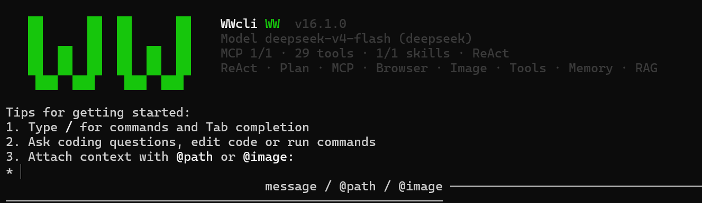
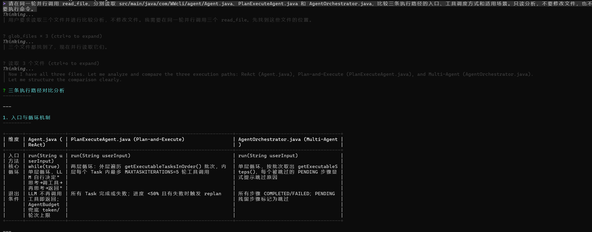
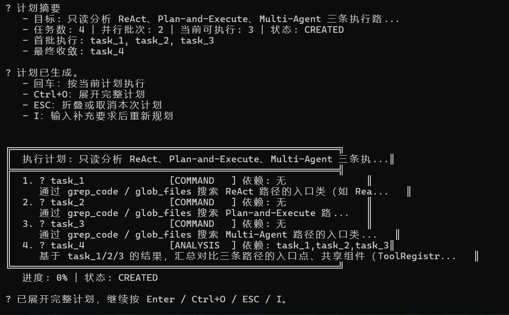
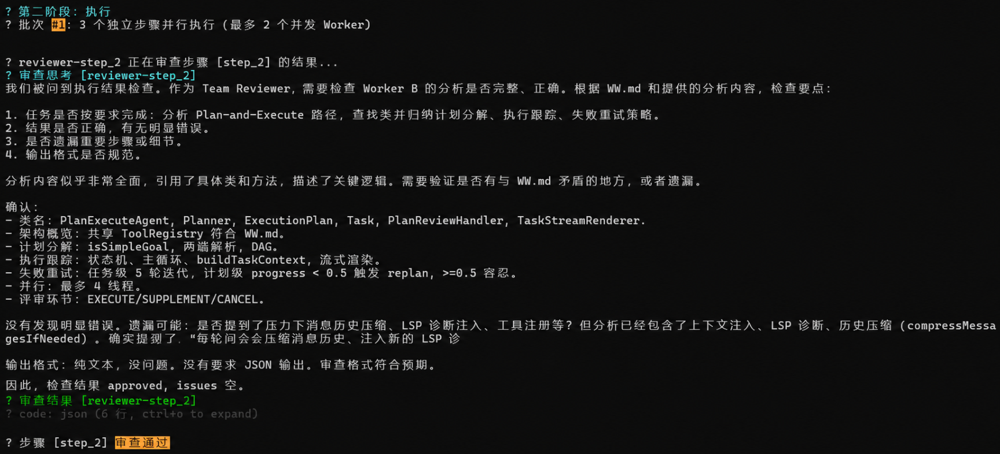

# WWcli

> 面向代码库工作的 Java Agent CLI，在终端中完成代码理解、任务规划、工具调用与多 Agent 协作。

**作者：汪汪**

WWcli 以 Java 17 构建，默认使用 ReAct 执行任务，并提供 Plan-and-Execute、DAG 调度、Multi-Agent、MCP、Memory、RAG、浏览器自动化和安全审批等能力。项目面向真实代码库工作流，支持流式推理、上下文压缩、并行工具调用和多模型切换。

## 核心能力

- **ReAct Agent**：模型按“推理 → 调用工具 → 读取结果 → 继续推理”的循环完成任务。
- **并行工具调用**：同一轮多个独立工具调用最多 4 路并发，结果按原调用顺序回灌。
- **Plan-and-Execute + DAG**：把复杂请求拆成带依赖关系的任务，独立节点按批次并行执行。
- **Multi-Agent**：Planner 规划、Worker 执行、Reviewer 审查，审查未通过时携带反馈重试。
- **MCP**：支持 stdio 与 Streamable HTTP，外部工具动态注册为 `mcp__{server}__{tool}`。
- **上下文与记忆**：短期记忆、长期记忆、项目级 `WW.md` 和长上下文自动压缩。
- **代码库理解**：`glob_files`、`grep_code`、`read_file` 实时探索，RAG 作为语义检索辅助。
- **安全控制**：HITL 审批、路径围栏、危险命令拦截、资源限制、操作审计和 Side-Git 快照。

## 核心能力演进

| 能力线 | 演进内容 |
|---|---|
| **ReAct Agent Loop** | 从基础模型对话扩展为“推理 → 行动 → 观察”的自主工具循环，串联 Tool Calling、工具执行与结果回灌；通过 `AgentBudget` 增加连续 3 轮重复调用检测和 50 轮硬上限，避免异常死循环。 |
| **Plan-and-Execute + DAG** | 由 Planner 将复杂需求拆解为任务 DAG，执行前校验缺失依赖和循环依赖；无依赖节点按批次并行调度，最大并发 4 路，任务结果按原始顺序回放。 |
| **Multi-Agent 协作** | 构建 Planner–Worker–Reviewer 主从架构，通过 `BlockingQueue` 池化管理默认 2 个 Worker，避免并行任务争用同一 Agent 状态；Reviewer 逐项审查，未通过步骤携带反馈最多重试 2 次。 |
| **Memory 与上下文压缩** | 短期记忆维护当前会话，长期记忆按项目或全局作用域持久化；Compactor 为摘要输出预留 20K Token，并保留 13K 安全缓冲，200K/1M 窗口分别在约 167K/967K Token 触发压缩。 |
| **MCP 工具生态** | 实现 MCP 客户端，支持 stdio 与 Streamable HTTP；通过 `initialize`、`notifications/initialized` 和 `tools/list` 完成握手与动态工具注册，默认可接入 Chrome DevTools MCP，当前演示环境注册 29 个外部工具。 |

## 运行效果

### 启动界面与 MCP

启动后显示当前模型、MCP server、动态工具数量、Skill 和运行模式。MCP 在后台异步初始化，可通过 `/mcp` 查看最新状态。



### ReAct 并行工具调用

ReAct 会根据任务自主选择工具。同一轮产生多个互不依赖的工具调用时，WWcli 通过统一的 `executeTools()` 入口并行执行，再将结果按原始顺序返回给模型。



### Plan-and-Execute 与 DAG

使用 `/plan <任务>` 进入一次性计划模式。Planner 生成任务及依赖关系，CLI 支持在执行前展开计划、补充要求、取消或确认；没有依赖的任务会进入同一并行批次。执行前会校验依赖是否存在以及 DAG 是否有环，无效计划会被拒绝并指出相关任务 ID。



### Multi-Agent 协作

使用 `/team <任务>` 启动多 Agent 模式。Planner 负责拆解任务，默认两个 Worker 按依赖批次执行，Reviewer 逐项检查结果；结构化 `approved` 字段优先，中英文否定、损坏 JSON 或模糊结论均保守判为不通过，未通过的步骤最多重试两次。



## 执行架构

三条主执行路径共享 `ToolRegistry`、`MemoryManager` 和 `SnapshotService`：

| 模式 | 入口 | 使用方式 | 适合场景 |
|---|---|---|---|
| ReAct | `Agent.java` | 默认模式 | 探索式、单步或工具链较短的任务 |
| Plan-and-Execute | `PlanExecuteAgent.java` | `/plan <任务>` | 多步骤、有明确依赖关系的复杂任务 |
| Multi-Agent | `AgentOrchestrator.java` | `/team <任务>` | 需要角色分工、并行执行和独立审查的任务 |

核心内置工具包括：

`read_file`、`write_file`、`list_dir`、`glob_files`、`grep_code`、`execute_command`、`create_project`、`search_code`、`web_search`、`web_fetch`、`revert_turn`。

## 快速开始

### 环境要求

- Java 17+
- Maven 3.8+
- 至少配置一个受支持模型的 API Key
- 可选：Node.js / `npx`，用于启动默认 Chrome DevTools MCP
- 可选：`ripgrep`，未安装时 `grep_code` 自动回退到 Java 扫描
- 可选：Ollama，用于本地 RAG Embedding

### 1. 创建本地配置

Windows PowerShell：

```powershell
Copy-Item .env.example .env
```

macOS / Linux：

```bash
cp .env.example .env
```

编辑 `.env`，至少填写一个 API Key，例如：

```dotenv
DEEPSEEK_API_KEY=your_api_key_here
```

也可以配置 `GLM_API_KEY`、`STEP_API_KEY`、`KIMI_API_KEY`、`FREELLMAPI_API_KEY`、`XFYUN_MAAS_API_KEY` 或 `AGNES_API_KEY`。

> `.env` 包含敏感配置，已被 Git 忽略，请勿提交真实 API Key。

### 2. 编译运行

```bash
mvn clean package
java -jar target/WWcli-1.0-SNAPSHOT.jar
```

Banner 显示版本为 `v16.1.0`，Maven 产物版本为 `1.0-SNAPSHOT`，两者用途不同。

### 3. 可选：MCP

MCP 配置按 server 名合并：

1. 用户级：`~/.WWcli/mcp.json`
2. 项目级：`.WWcli/mcp.json`

首次运行时，如果用户级配置不存在，WWcli 会创建默认的 Chrome DevTools MCP 配置。运行中可使用：

```text
/mcp
/mcp logs chrome-devtools
/mcp restart chrome-devtools
```

Windows 启动 stdio MCP 时会按 `PATH` / `PATHEXT` 解析无路径命令，例如将 `npx` 定位到已安装的 `npx.cmd`。Node.js 的安装目录仍需在 `PATH` 中；也可以在 `mcp.json` 的 `command` 中填写显式可执行文件路径。

MCP 工具数量取决于已启用的 server 及其版本，截图中的数量仅代表对应运行环境。

## 常用命令

| 命令 | 作用 |
|---|---|
| `/plan <任务>` | 使用 Plan-and-Execute 执行一次任务 |
| `/team <任务>` | 使用 Multi-Agent 协作执行一次任务 |
| `/mcp` | 查看 MCP server 和动态工具状态 |
| `/model <provider>` | 切换模型 provider |
| `/context` | 查看上下文、Token 和记忆状态 |
| `/compact` | 手动压缩当前 ReAct 对话历史 |
| `/memory list` | 查看长期记忆 |
| `/save <事实>` | 显式保存项目级长期记忆 |
| `/index [路径]` | 建立代码库 RAG 索引 |
| `/search <查询>` | 语义检索代码 |
| `/browser status` | 查看浏览器连接状态 |
| `/clear` | 清空当前对话上下文，保留长期记忆 |
| `/exit` | 退出 WWcli |

输入 `/` 后可使用 Tab 补全命令；普通输入还支持 `@path`、`@image:` 和 MCP resource 引用。

## 技术栈

- Java 17 / Maven
- JLine 4
- OkHttp / Jackson
- SQLite
- JavaParser
- MCP stdio / Streamable HTTP
- JUnit 5

## 项目结构

```text
src/main/java/com/WWcli/
├── agent/       ReAct、Plan-and-Execute、Multi-Agent
├── cli/         CLI 入口、命令解析、交互
├── mcp/         MCP client、server 管理与 transport
├── tool/        内置工具与统一并行执行入口
├── memory/      短期记忆、长期记忆、上下文压缩
├── plan/        Planner、ExecutionPlan、DAG Task
├── rag/         代码索引、AST、向量检索
├── render/      inline、lanterna、plain renderer
├── policy/      路径、命令和资源安全策略
├── snapshot/    Side-Git 快照与恢复
└── llm/         多模型 provider client
```

## 验证

```bash
# 构建可运行 JAR（默认跳过测试）
mvn clean package

# 常规快速回归
mvn test -Pquick

# Plan / DAG
mvn test -Dtest=ExecutionPlanTest

# Multi-Agent
mvn test -Dtest=AgentRoleTest,AgentMessageTest,AgentOrchestratorTest
```

## 已知边界

容器/VM 沙箱、MCP OAuth、sampling 和 server 自动重启仍属于后续增强方向，不应视为当前已交付能力。

## 作者

汪汪
